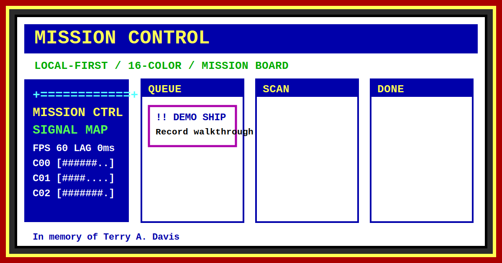

# Mission Control



A free, local-first, 16-color mission board dedicated to Terry A. Davis.

This is a single-file browser app inspired by old command surfaces and the clarity of direct tools. It stores your board in `localStorage`, runs without a backend, and can be opened directly from `index.html`.

## Features

- Three-lane mission board: `QUEUE`, `SCAN`, `DONE`
- Drag missions between lanes and reorder missions inside each lane
- Priority markers with 16-color visual cues
- Dashboard with next action, today queue, progress, and latest log state
- Mission editor with title, next action, priority, progress, tags, URL, and image URL
- Optional thumbnails and visible links on mission cards
- Import/export/backup JSON
- Local automatic backup snapshots in `localStorage`
- Reset board confirmation
- Resizable left system rail and right terminal area
- Resizable floating windows
- Animated ASCII rail with browser-visible system/network information
- Signal map based on browser-visible performance signals. Browsers do not expose real per-core CPU usage.
- Local terminal-style command panel with autocomplete
- Optional terminal beep sounds with mute
- Light/night modes

## Terminal Commands

```text
help
new "Mission title"
edit
open M-001
done M-001
scan M-001
queue M-001
find text
theme
filter all
filter queue
filter scan
filter done
brief
status
backup
export
import
reset
log
sound
clear
```

## Link Previews

`assets/og.svg` is the Open Graph preview image. Apps like Discord, WhatsApp, X, and Slack use Open Graph metadata to show a large thumbnail when somebody shares the project URL. The favicon is `assets/icon.svg`, which is the small icon browsers show in tabs and bookmarks.

## Data

Mission Control saves data in the browser under localStorage. Use `File > Export JSON` to keep backups or move boards between browsers.

Example mission JSON:

```json
{
  "title": "Ship the demo",
  "codename": "M-001",
  "status": "queue",
  "priority": "high",
  "progress": 35,
  "nextAction": "Record a short walkthrough",
  "referenceUrl": "https://example.com",
  "imageUrl": "https://example.com/thumbnail.jpg",
  "tags": ["demo", "launch"]
}
```

## Dedication

In memory of Terry A. Davis (1969-2018). Respect for the engineering, the directness, and the singular vision.

This project is not affiliated with TempleOS.

## License

MIT
